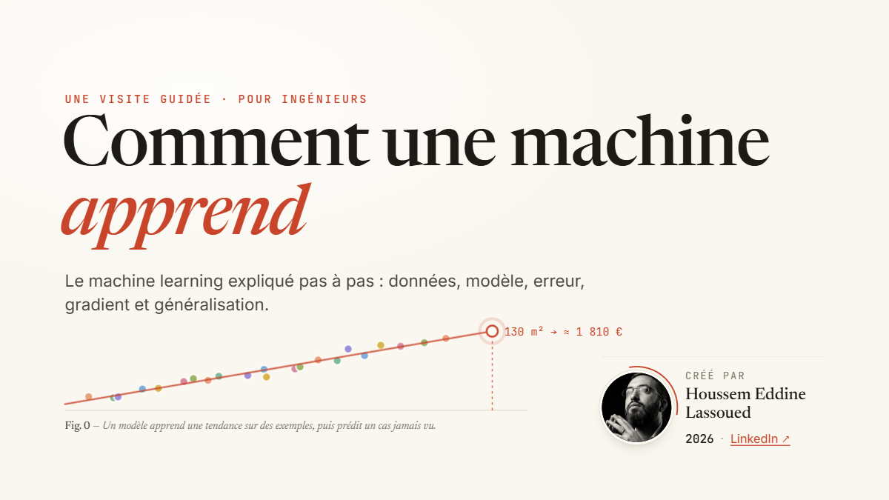
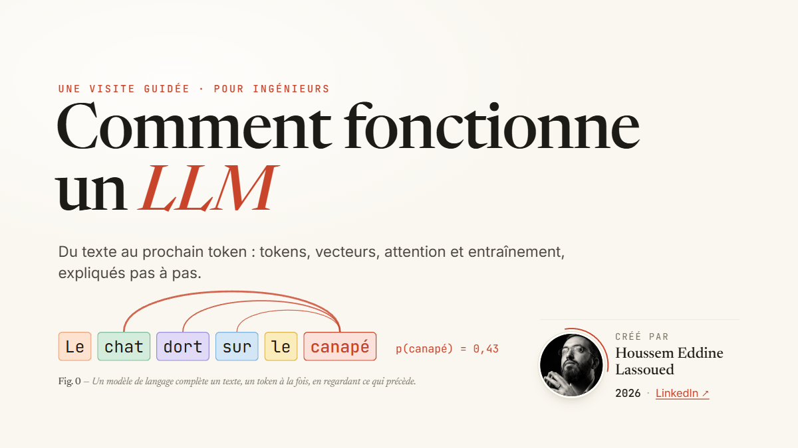
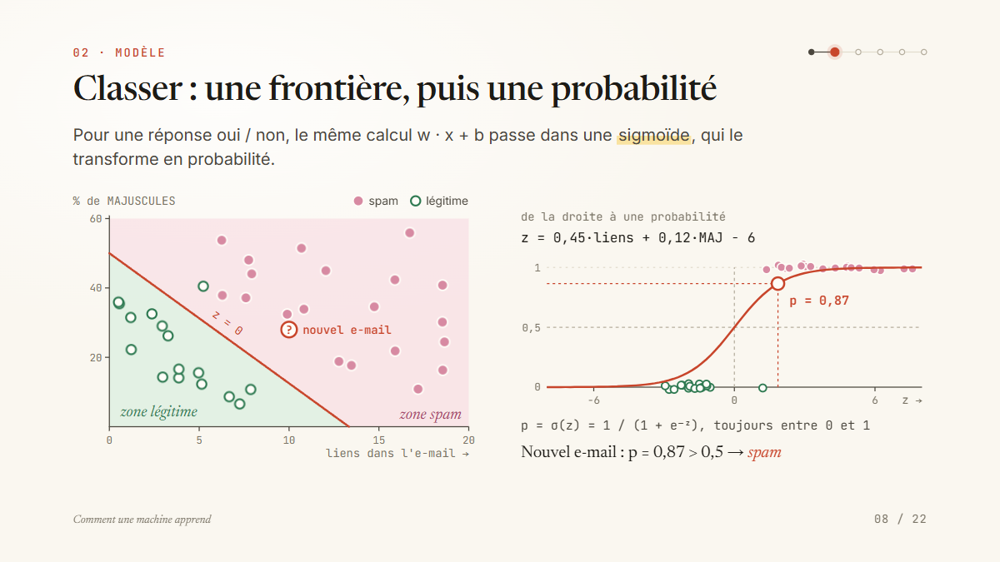
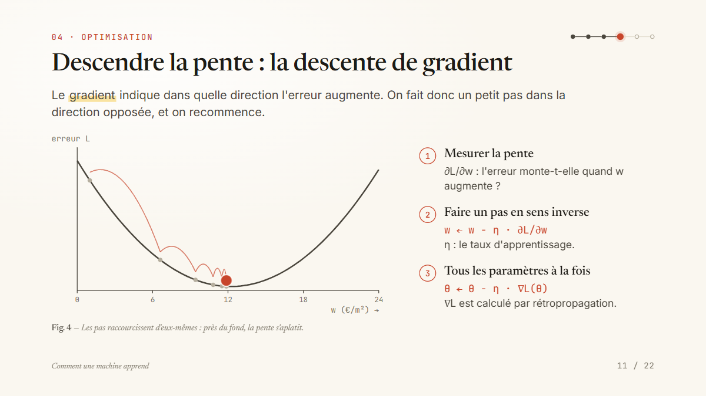
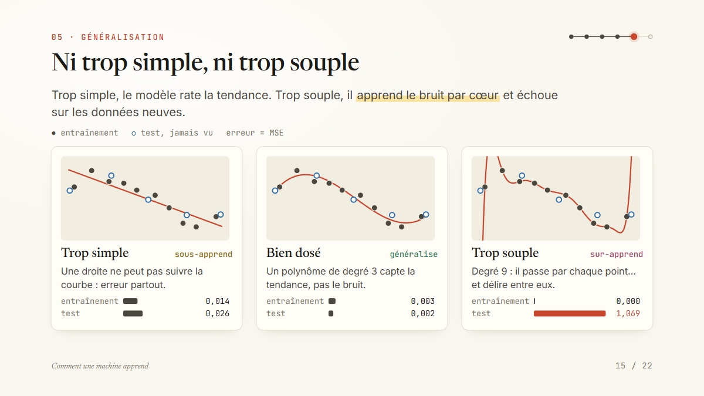
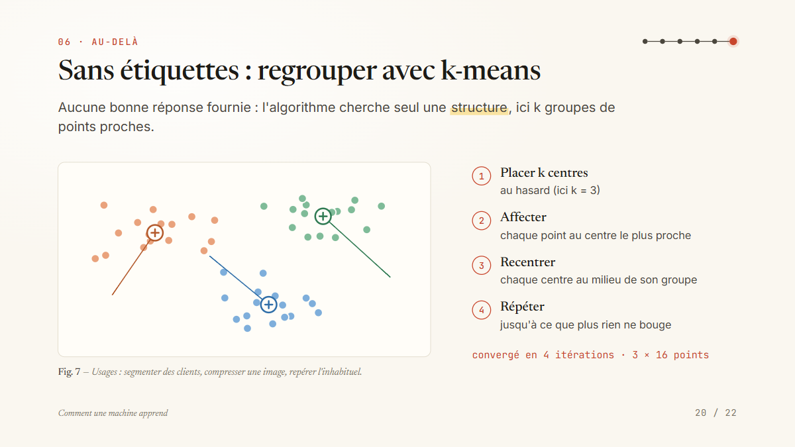
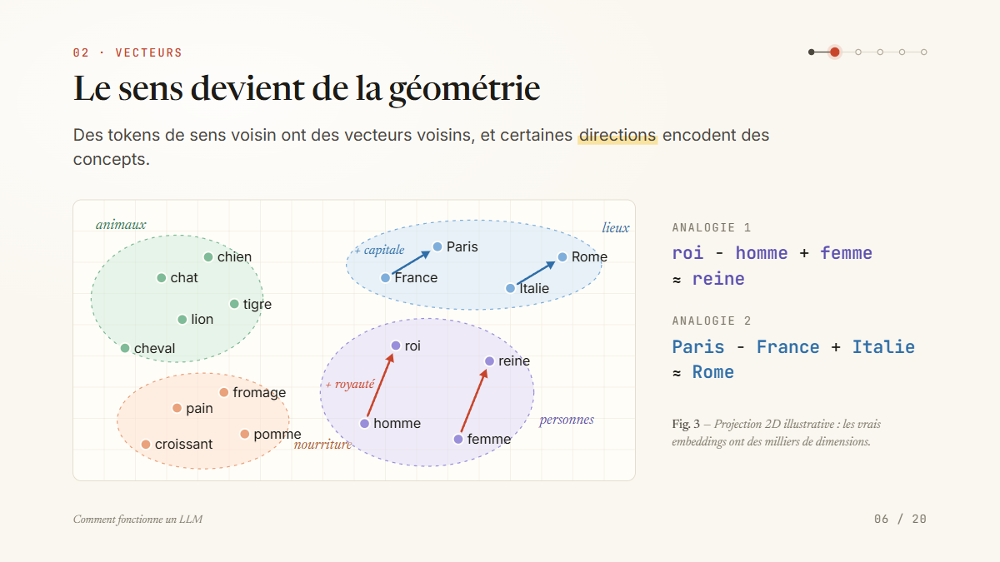
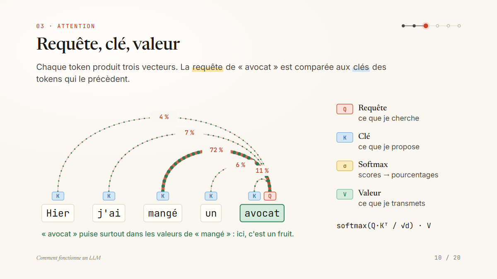
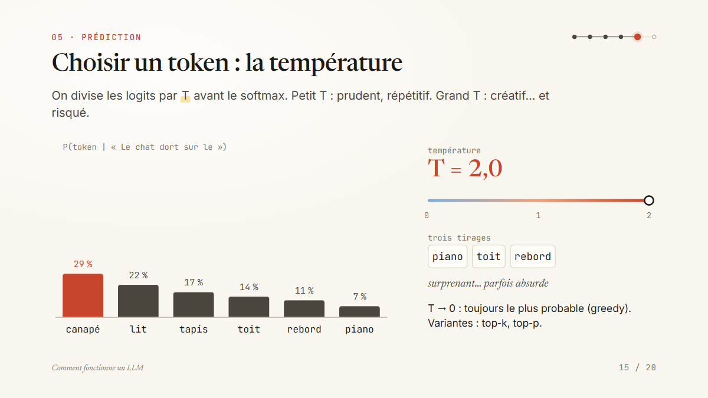

<div align="center">

# Comprendre l'IA, une slide à la fois

**Deux présentations interactives en français : comment fonctionne un LLM, et comment une machine apprend.**<br>
Chaque page est un composant React, chaque schéma est calculé, chaque clic révèle une étape.

[](https://github.com/houssemeddinelassoued/my-deck/actions/workflows/deploy-pages.yml)


### [▶ Ouvrir les présentations en ligne](https://houssemeddinelassoued.github.io/my-deck/)




</div>

---

## Les présentations

| Présentation | Pages | Pour qui | En ligne |
| --- | :---: | --- | --- |
| **Comment une machine apprend**<br><sub>`slides/ml-explique`</sub> | 22 | Ingénieurs qui veulent comprendre le machine learning de l'intérieur | [Ouvrir](https://houssemeddinelassoued.github.io/my-deck/s/ml-explique) · [Vue présentateur](https://houssemeddinelassoued.github.io/my-deck/s/ml-explique/presenter) |
| **Comment fonctionne un LLM**<br><sub>`slides/llm-explique`</sub> | 20 | Ingénieurs curieux de ce qui se passe entre le prompt et la réponse | [Ouvrir](https://houssemeddinelassoued.github.io/my-deck/s/llm-explique) · [Vue présentateur](https://houssemeddinelassoued.github.io/my-deck/s/llm-explique/presenter) |
| Getting started<br><sub>`slides/getting-started`</sub> | 18 | Démo fournie par le framework open-slide | [Ouvrir](https://houssemeddinelassoued.github.io/my-deck/s/getting-started) |

Les deux présentations partagent la même direction artistique : papier et encre, titres en Newsreader, texte en Inter, code en JetBrains Mono, un rouge brique comme accent. Chacune a ses **notes de l'orateur** complètes, page par page, avec les repères de clics.

### Comment une machine apprend

Un fil rouge du début à la fin : **prédire le loyer d'un appartement à partir de sa surface**. Puis un second exemple, la détection de spam, pour la classification.

| Chapitre | Ce qu'on y voit |
| --- | --- |
| **Introduction** | Programmer ou apprendre · supervisé, non supervisé, par renforcement · la recette en six étapes |
| **01 · Données** | Un jeu de données est un tableau (x, y) · encoder catégories, images et échelles |
| **02 · Modèle** | Une droite ŷ = w·x + b et ses réglages · classer avec une frontière et une sigmoïde |
| **03 · Erreur** | Les résidus et la MSE, dessinée en carrés · le paysage de l'erreur |
| **04 · Optimisation** | La descente de gradient, pas à pas · le taux d'apprentissage η · les mini-lots (SGD) |
| **05 · Généralisation** | Entraînement / validation / test · sous- et sur-apprentissage · courbes d'apprentissage · précision et rappel |
| **06 · Au-delà** | Arbres de décision · réseaux de neurones · k-means |
| **Conclusion** | Biais, corrélation ≠ causalité, dérive des données |

Les données sont fictives, mais **tous les chiffres affichés sont calculés dans la slide** : la droite des moindres carrés (w ≈ 12,2 €/m²), les erreurs de test des polynômes de degré 1, 3 et 9, les itérations de k-means…

 
 

### Comment fonctionne un LLM

Une seule phrase suivie de bout en bout : **« Le chat dort sur le… »**, jusqu'au token suivant.

| Chapitre | Ce qu'on y voit |
| --- | --- |
| **Introduction** | Une seule tâche : prédire le token suivant · le voyage d'une phrase |
| **01 · Tokens** | Découper le texte en tokens |
| **02 · Vecteurs** | Embeddings · le sens devient géométrie · en 3D, puis en milliers de dimensions |
| **03 · Attention** | Un même mot, plusieurs sens · requête, clé, valeur · la matrice d'attention · les têtes multiples |
| **04 · Transformer** | Un bloc, empilé N fois |
| **05 · Prédiction** | Des logits au prochain token · la température · la boucle autorégressive |
| **06 · Entraînement** | Le pré-entraînement · du compléteur de texte à l'assistant |
| **Conclusion** | Ce que ce mécanisme implique |

  

---

## Présenter

Ouvrez une présentation, puis le menu **Present** : **Play** (dans la fenêtre), **Fullscreen**, ou **Presenter mode**. Beaucoup de pages se construisent clic par clic : chaque **→** révèle l'étape suivante avant de passer à la page d'après.

| Touche | Action |
| --- | --- |
| `→` · `Espace` / `←` | Étape ou page suivante / précédente |
| `F` | Lancer en plein écran |
| `O` | Vue d'ensemble des pages |
| `P` | Ouvrir la vue présentateur |
| `B` · `W` | Écran noir · écran blanc |
| `L` | Pointeur laser |
| `?` | Aide des raccourcis |
| `Esc` | Fermer / quitter |

La **vue présentateur** affiche les notes de l'orateur, la page suivante et un minuteur. Ouvrez-la dans une seconde fenêtre du même navigateur : elle suit la présentation.

### En ligne ou en local ?

Le site GitHub Pages est la version **statique** : idéale pour présenter et partager. Les outils d'édition d'open-slide (inspecteur, panneau Design, gestion des images, modification des notes) ont besoin du serveur de développement, donc d'une installation locale.

| | GitHub Pages | `npm run dev` |
| --- | :---: | :---: |
| Lire, naviguer, plein écran, vue présentateur | ✅ | ✅ |
| Lire les notes de l'orateur | ✅ | ✅ |
| Modifier les slides avec rechargement à chaud | — | ✅ |
| Inspecteur, panneau Design, assets | — | ✅ |

---

## Lancer en local

Prérequis : **Node.js 22.12+** (ou 20.19+).

```bash
git clone https://github.com/houssemeddinelassoued/my-deck.git
cd my-deck
npm install
npm run dev
```

Puis ouvrez <http://localhost:5173>.

| Commande | Rôle |
| --- | --- |
| `npm run dev` | Serveur de développement avec rechargement à chaud et outils d'édition |
| `npm run build` | Génère le site statique dans `dist/` |
| `npm run preview` | Sert le build localement pour le vérifier |

## Structure du dépôt

```text
my-deck/
├── slides/
│   ├── ml-explique/          # Comment une machine apprend
│   │   ├── index.tsx         #   les 22 pages + les notes de l'orateur
│   │   └── assets/
│   ├── llm-explique/         # Comment fonctionne un LLM
│   └── getting-started/      # démo du framework
├── assets/                   # images partagées entre présentations
├── themes/                   # thèmes réutilisables
├── docs/preview/             # captures utilisées dans ce README
├── .github/workflows/        # déploiement GitHub Pages
├── .claude/skills/           # skills Claude Code pour créer et modifier les slides
└── open-slide.config.ts
```

## Déploiement

Chaque push sur `main` déclenche [`.github/workflows/deploy-pages.yml`](.github/workflows/deploy-pages.yml) :

1. `npm ci`, puis `npm run build` ;
2. le chemin de base `/<nom-du-dépôt>/` est injecté dans `open-slide.config.ts` **sur la machine de CI uniquement**, pour que les liens fonctionnent sous `houssemeddinelassoued.github.io/my-deck/` (en local, le site reste servi depuis `/`). Si le dépôt est renommé, le chemin suit automatiquement ;
3. `index.html` est copié en `404.html`, pour que les liens directs comme `/s/ml-explique` s'ouvrent ;
4. le dossier `dist/` est publié sur GitHub Pages.

Le déploiement peut aussi être relancé à la main depuis l'onglet **Actions**.

## Créer une présentation

Une présentation, c'est un dossier `slides/<id>/` avec un `index.tsx` qui exporte un tableau de pages React. Chaque page s'affiche sur un canevas fixe de **1920 × 1080** pixels.

```tsx
// slides/ma-presentation/index.tsx
import type { Page, SlideMeta } from '@open-slide/core';

const Couverture: Page = () => (
  <div style={{ width: '100%', height: '100%', padding: 140 }}>
    <h1 style={{ fontSize: 150 }}>Bonjour</h1>
  </div>
);

export const meta: SlideMeta = { title: 'Ma présentation' };
export const notes = ["Ce que je dis sur la couverture."];
export default [Couverture] satisfies Page[];
```

Le dépôt est configuré pour **Claude Code** : demandez « fais une présentation sur… » et le skill `create-slide` prend le relais. `apply-comments` applique les commentaires laissés avec l'inspecteur, et `create-theme` crée un thème réutilisable. Le guide complet est dans [`CLAUDE.md`](CLAUDE.md).

---

<div align="center">

Créé par **Houssem Eddine Lassoued** · [LinkedIn](https://www.linkedin.com/in/houssemeddinelassoued)<br>
<sub>Construit avec <a href="https://open-slide.dev">open-slide</a>.</sub>

</div>
